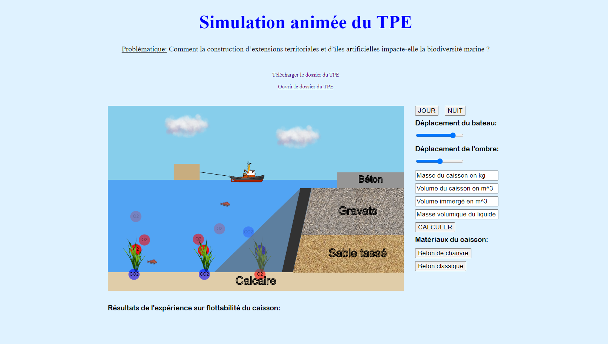

## Description du Projet

Le TPE (Travaux Pratiques Encadrés) est une épreuve du Baccalauréat pour les élèves de 1ère (ancienne réforme).
Le TPE est un projet de groupe de plusieurs mois durant lesquels les élèves mettent en place un raisonnement scientifique dans le but de répondre à une problématique. Le TPE consiste en la rédaction d’un dossier présentant en détail l’ensemble de la démarche scientifique et en la présentation devant un jury du travail effectué.
Mon groupe et moi avons décidé de créer une simulation interactive représentant les différents aspects de notre TPE dans le but de mieux comprendre les enjeux de notre sujet et également afin d’illustrer nos propos lors de l’oral final.

[Voir la simulation](http://simulation-tpe.transept.net/)

## Aperçu de la Simulation

